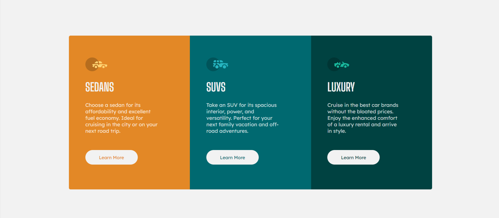

# Welcome to my Webpage of Frontend Mentor - 3-column preview card component solution

This is a solution to the [3-column preview card component challenge on Frontend Mentor](https://www.frontendmentor.io/challenges/3column-preview-card-component-pH92eAR2-). Frontend Mentor challenges help you improve your coding skills by building realistic projects. 

## Overview

### The challenge

Users should be able to:

- View the optimal layout depending on their device's screen size
- See hover states for interactive elements

### Screenshot

### Links

- Solution URL: (https://github.com/Abubakar-Tamboli/3-Column-Preview-Card)
- Live Site URL: (https://abubakar-tamboli.github.io/3-Column-Preview-Card/)

## My process

### Built with

- Semantic HTML5 markup
- CSS custom properties
- Flexbox

## Author

- Website - [Abubakar Tamboli](https://github.com/Abubakar-Tamboli)
- Frontend Mentor - [@Abubakar-Tamboli](https://www.frontendmentor.io/profile/Abubakar-Tamboli)

